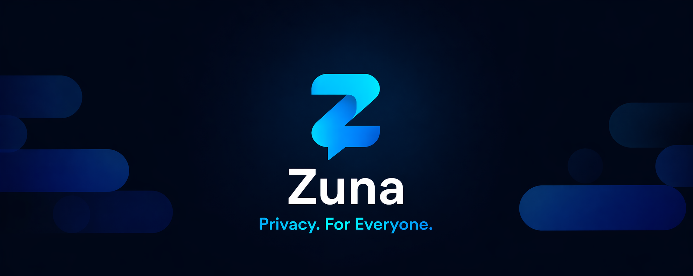
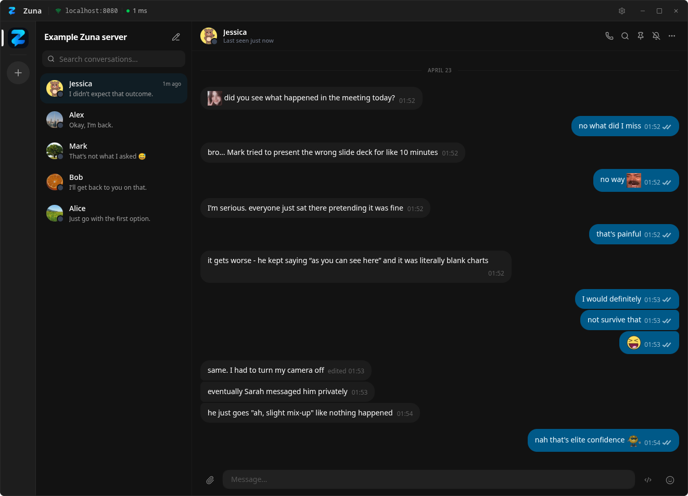
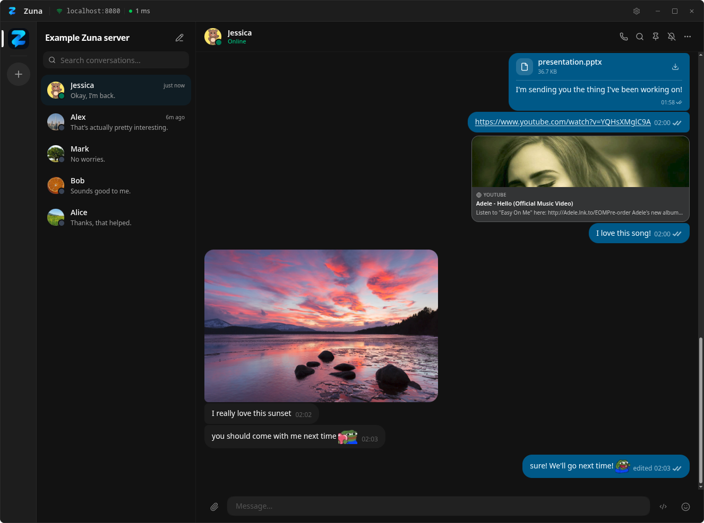
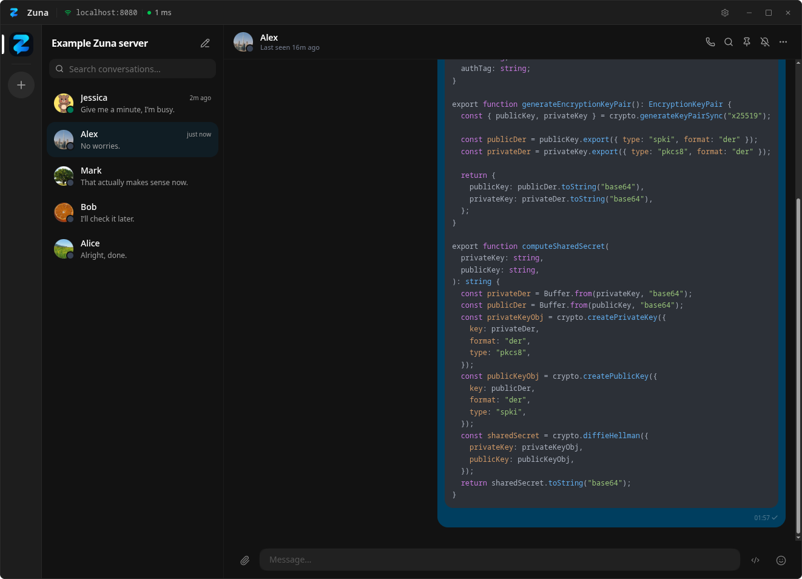

<p align="center">
  
</p>

<p align="center">
  <a href="LICENSE"></a>
  
  <a href="https://github.com/zuna-app/zuna/actions/workflows/release.yml"></a>
</p>

<br/>

**Zuna** is a fully self-hosted, end-to-end encrypted chat and voice service. Run your own server, own your data, and communicate safely with others using a modern and powerful desktop and mobile client apps.

<table align="center">
  <tr>
    <td align="center">
      <strong>Join the Zuna community on Discord</strong><br/>
      Get updates, ask questions, share feedback, and help shape the project.<br/><br/>
      <a href="https://discord.gg/WSk3MnpYNK">
        
      </a>
    </td>
  </tr>
</table>

> [!WARNING]
> Zuna is currently in **early alpha**. Core functionality is constantly improving and breaking changes (including full database wipes!) are all but guaranteed. We expect we'll be able to move to a little bit more stable beta releases in a few months. Thank you for your patience and in the meantime - we're happy to accept any contributions that would help speed things up!

---

## Table of Contents

- [Features](#features)
- [Screenshots](#screenshots)
- [Motivation](#motivation)
- [Core Philosophy](#core-philosophy)
- [Architecture](#architecture)
- [Self-Hosting with Zuna Install](#self-hosting-with-zuna-install)
- [Self-Hosting with Docker](#self-hosting-with-docker)
- [Contributing](#contributing)
- [License](#license)

---

## Features

- Fully end-to-end encrypted message, voice and screensharing transport
- Beautiful and modern desktop application
- Mature LiveKit voice/screensharing platform integration
- 7tv integration for animated emotes
- Code mode
- Push notifications
- Encrypted file and photo sharing
- Completely self-hosted
- Editing/deleting messages
- Pinning messages

---

## Screenshots

<p align="center">
  
  
  
</p>

---

## Motivation

Zuna was not conceived as just another platform, but as a response to a growing and tangible need. Across both the European Union and the United States, there has been a noticeable shift toward increased regulation of online speech, often justified through broadly appealing but frequently insincere narratives about protecting children online.

While safeguarding minors is a legitimate concern, many of the proposed measures - such as mandatory age verification systems and sweeping initiatives like so-called “chat control” - introduce serious risks to privacy, security, and the fundamental right to communicate freely. These policies, if implemented as currently envisioned, could undermine encryption, expose sensitive user data, and create precedents for broader surveillance. Zuna emerges in this context as an attempt to preserve a space where individuals can communicate safely, privately, and without undue interference, resisting a trajectory that increasingly conflates safety with control.

Why not rely on existing, mature open-source end-to-end encrypted chat platforms? In many cases, you absolutely can - and for some users, they are an excellent choice. However, for us (and, we suspect, for many others), these solutions fell short in key areas such as simplicity, user experience, and feature design. Too often, they either prioritize technical robustness at the expense of usability or replicate familiar patterns without rethinking them.

---

## Core Philosophy

Zuna is not intended - at least at this stage - to compete directly with established platforms such as Signal or Matrix in terms of protocol maturity, formal verification, or encryption rigor. This is, in part, a deliberate choice rather than a shortcoming. From the outset, our guiding principle has been to strike a careful balance between security and usability.

Many secure communication tools achieve strong guarantees but at the cost of added complexity, friction, or user burden. Zuna takes a different approach: we aim to provide a high baseline of meaningful, practical security while minimizing the need for constant user intervention or technical understanding. Instead of expecting users to actively manage intricate settings or workflows, we focus on delivering essential protections by default, in a way that feels seamless and unobtrusive.

Self-hosting fundamentally changes the threat model, and Zuna is designed to take advantage of that. By allowing users to operate their own infrastructure - or rely on instances they trust - we can reduce the need for certain defensive measures that are essential in large, centralized platforms. In those environments, providers must assume adversarial conditions at scale, often leading to complex safeguards that introduce friction or limit usability.

_Our objective is not to compromise on security, but to make it more accessible - ensuring that users benefit from robust protections without being overwhelmed or discouraged from using them altogether._

---

## Architecture

By default, running a Zuna server is intentionally straightforward: a single Linux instance and a supported database - such as SQLite, MariaDB, or PostgreSQL - are sufficient to get started. This simplicity, however, assumes the use of our cloud gateway relay (gateway.zuna.chat). That component handles certain external integrations, most notably enabling push notifications for iOS devices.

Due to Apple’s platform restrictions, delivering push notifications on iOS requires integration with their proprietary infrastructure. As a result, using Zuna’s iOS application in its standard form depends on our gateway relay. While this introduces a limited external dependency, it allows most users to deploy and operate Zuna with minimal setup complexity.

For those who prefer a fully independent setup, it is possible to replace our gateway relay with your own. This involves configuring a custom relay service, linking it to your own Apple Developer account, and distributing a properly signed version of the iOS application. This approach offers greater control and removes reliance on our infrastructure, but it is significantly more complex and requires enrollment in Apple’s paid developer program.

> [!TIP]
> Zuna is currently in **early alpha**. This means the iOS app or the iOS push notifications are not complete just yet. In the meantime, for just desktop notifications you can easily run your own gateway relay without an Apple developer account.

## Self-Hosting with Zuna Install

TBD.

Zuna Install will be a 1-click solution to setup, configure and install Zuna server with all required dependencies on a fresh Linux server installation. For now, Docker is your next best option.

## Self-Hosting with Docker

The easiest way to run a Zuna server is with Docker Compose. The provided setup bundles **zuna-server**, **MariaDB 11**, and **LiveKit** (for voice calls and screen sharing) into a single stack.

### Prerequisites

- Docker 24+ and Docker Compose v2
- Ports `25510`, `7880`, `7881`, and UDP `50000-50100` range open in your firewall (default compose setup)

### Quick Start

```bash
# 1. Clone the repository
git clone https://github.com/zuna-app/zuna.git
cd zuna

# 2. Create a .env file with your own secrets
cp .env.example .env   # then edit .env!

# 3. Build and start all services
docker compose up -d --build
```

On first boot, `zuna-server` automatically:

- Writes `/data/config.toml` into the `zuna-data` volume
- Generates and persists `server_id` in `[server]`
- Generates an Ed25519 server keypair
- Generates self-signed TLS files (when `TLS_AUTO_GENERATE=true`)

The server is ready when you see `zuna-server` log `starting server`.

---

### Configuration Parameters

All values below can be set in `.env` at repository root. Compose reads `.env` and injects values into container environment according to `docker-compose.yml`.

The defaults are for local development. Change secrets before any public deployment.

#### MariaDB

| Variable              | Default    | Description                        |
| --------------------- | ---------- | ---------------------------------- |
| `MYSQL_ROOT_PASSWORD` | `changeme` | MariaDB root password              |
| `MYSQL_DATABASE`      | `zuna`     | Database name                      |
| `MYSQL_USER`          | `zuna`     | Application database user          |
| `MYSQL_PASSWORD`      | `zunapass` | Application database user password |

#### LiveKit (voice / screen sharing)

| Variable             | Default                 | Description                                         |
| -------------------- | ----------------------- | --------------------------------------------------- |
| `LIVEKIT_API_KEY`    | `zunakey`               | Must match between `livekit-init` and `zuna-server` |
| `LIVEKIT_API_SECRET` | `zunaS3cr3tChangeme123` | Keep private                                        |
| `LIVEKIT_HOST`       | `1.2.3.4`               | LiveKit Host                                        |
| `LIVEKIT_PORT`       | `7880`                  | LiveKit Port                                        |

#### TLS

| Variable             | Default | Description                                                   |
| -------------------- | ------- | ------------------------------------------------------------- |
| `TLS_PUBLIC_ADDRESS` | ``      | Address written to `[tls].public_address` in generated config |
| `TLS_AUTO_GENERATE`  | `true`  | Whether the server auto-generates self-signed TLS cert/key    |

#### Example `.env` file

```dotenv
# MariaDB
# Root password for the zuna-mysql container (not used by the app directly).
MYSQL_ROOT_PASSWORD=changeme

# Database name, app user and password — must match across all services.
MYSQL_DATABASE=zuna
MYSQL_USER=zuna
MYSQL_PASSWORD=zunapass

# LiveKit
# API key and secret shared between the LiveKit server and zuna-server.
# Use a long random string for the secret in production. (at least 32 characters)
LIVEKIT_API_KEY=lk_api_key
LIVEKIT_API_SECRET=zunaS3cr3tChangeme123
# LIVEKIT_HOST and LIVEKIT_PORT specify the public address where the LiveKit server is reachable by Zuna and clients.
LIVEKIT_HOST=1.2.3.4
LIVEKIT_PORT=7880

# TLS Configuration
# Important: Change TLS_PUBLIC_ADDRESS to your server's public IP or domain name
# even if auto-generating TLS certificates, otherwise the generated certificates will not be valid for your server's address.
TLS_PUBLIC_ADDRESS=
# For production, set TLS_AUTO_GENERATE to false and provide your own TLS certificates.
TLS_AUTO_GENERATE=true
```

---

### Post-Boot Server Config

After first start, config lives in the named volume `zuna-data` at `/data/config.toml`.

Inspect it with:

```bash
docker run --rm -v zuna_zuna-data:/data alpine cat /data/config.toml
```

Common keys to change:

| Key                    | Description                                                                   |
| ---------------------- | ----------------------------------------------------------------------------- |
| `[server].name`        | Public display name of your server                                            |
| `[server].password`    | Optional join password — set it to restrict who can register                  |
| `[server].logo`        | Path to a PNG/GIF logo file (mount a custom one into `zuna-data`)             |
| `[tls].auto_generate`  | `true` generates self-signed certs; set `false` and provide your own cert/key |
| `[tls].public_address` | Public IP or hostname used by TLS generation and clients                      |
| `[gateway].address`    | Address of the push-notification gateway (defaults to `gateway.zuna.chat`)    |
| `[sevenTv].enabled`    | Enable/disable 7TV animated emotes                                            |
| `[livekit].enabled`    | Toggled automatically based on whether `LIVEKIT_API_KEY` is set               |

> [!NOTE]
> `config.toml` is created once. Changing `.env` later does not fully regenerate server config. Edit `/data/config.toml` directly (or recreate the volume).

---

### Changing Ports

All exposed ports are configured in `docker-compose.yml` using the `HOST:CONTAINER` format. The container-side port must match what the service is actually listening on; only the host-side number needs to change.

| Service       | Variable | Default host port | What it does                 |
| ------------- | -------- | ----------------- | ---------------------------- |
| `zuna-server` | —        | `25510`           | Zuna REST + WebSocket API    |
| `livekit`     | —        | `7880`            | LiveKit HTTP / WebSocket API |
| `livekit`     | —        | `7881`            | LiveKit RTC TCP              |
| `livekit`     | —        | `50000-50100/udp` | WebRTC media (range UDP)     |

**Example — run zuna-server on port 9090 instead of 25510:**

```yaml
# docker-compose.yml
zuna-server:
  ports:
    - "9090:25510" # host:container
```

**Example — run LiveKit API on port 8888:**

```yaml
# docker-compose.yml
livekit:
  ports:
    - "8888:7880" # host:container
    - "7881:7881"
    - "50000-50100:50000-50100/udp"
```

> [!IMPORTANT]
> If you change the LiveKit API port on the host side you do **not** need to update `[livekit].port` in `config.toml` — that value refers to the port **inside** the Docker network, which is always `7880`. Only change it if you also change the container-side port mapping (i.e. `"XXXX:XXXX"` where both numbers differ).

---

### Deploying to a Public Server

For a production deployment you should:

1. Set a strong `[server].password` in `config.toml` to prevent open registration
2. Set `[tls].auto_generate = false` and provide real certificates (e.g. via Let's Encrypt)
3. Set `[tls].public_address` to your domain or public IP
4. In `docker-compose.yml`, update the `livekit.yaml` block inside `livekit-init` to set `use_external_ip: true` if LiveKit is behind NAT
5. Ensure your firewall exposes UDP media ports configured for LiveKit (default here: `50000/udp`)

### Troubleshooting Docker Startup

- `x509: cannot parse IP address of length 0`
  Set `public_address` in `config.toml` to a valid IP/domain and restart.

---

## Contributing

Contributions are very welcome since Zuna is currently maintained by just two devs. We're doing what we can to provide the best possible open messaging platform that is easy to understand, extend and use, but we can't do it all alone. Please open an issue before submitting a pull request for non-trivial changes so the approach can be discussed first.

---

## License

Zuna is released under the **GNU Affero General Public License v3.0** (AGPL-3.0).

This means you are free to use, modify, and distribute Zuna, but any modified version that is made available over a network must also be distributed under the same license with its source code made available. See the [LICENSE](LICENSE) file for the full text.

> TL;DR — run it, fork it, improve it. Just keep it open.

<br/>

<a href="https://www.buymeacoffee.com/socketbyte" target="_blank"></a>
